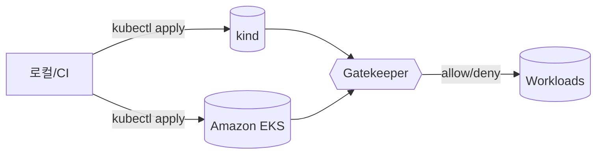

# Gatekeeper Demo Guide

## 전체 구성도


## 1. Privileged Pod 거부 시연
1. 준비: `make up` 실행 후 Gatekeeper와 정책이 올라온 상태여야 합니다.
2. 명령:
   ```bash
   ./scripts/test_violation_demo.sh
   ```
3. 예상 결과: `pod-privileged.yaml` 적용 시 다음과 같은 에러가 출력됩니다.
   ```text
   ---- pod-privileged.yaml ----
   Violation summary:
     Error from server (Forbidden): admission webhook "gatekeeper.sh" denied the request: Privileged containers are not allowed.
   ```
4. 위 터미널 로그 캡처를 `docs/images/privileged-deny.png`에 저장합니다.

## 2. 웨이버(waive=true + 만료일) 시연
1. 스크립트 실행:
   ```bash
   ./scripts/test_waiver_demo.sh waiver-demo
   ```
2. 스크립트는 `waiver-demo` 네임스페이스에 `guardrails.gatekeeper.dev/waive=true` 라벨과 향후 7일짜리 만료 어노테이션을 추가합니다.
3. `bad-privileged` 파드가 정상 생성되는 것을 확인합니다.
4. 스크립트가 만료일을 어제로 패치하면 즉시 다음 메시지가 출력됩니다.
   ```text
   Error from server (Forbidden): admission webhook "gatekeeper.sh" denied the request: Waiver expired on <날짜>; policy enforcement has resumed.
   ```
5. 허용 → 만료 → 재거부 3단계를 하나의 스크린샷으로 정리하여 `docs/images/waiver-expiry.png`에 저장합니다.

## 3. CI 파이프라인 (deny 기대)
1. GitHub Actions 워크플로(`.github/workflows/ci.yaml`)가 kind를 올리고 Gatekeeper, 정책, `make gator`를 수행합니다.
2. `Negative demo` 단계에서 `./scripts/test_violation_demo.sh` 실행 후 “denies observed (expected)” 로그가 남습니다.
3. 성공한 워크플로 화면을 캡처하여 `docs/images/ci-negative-demo.png`로 보관합니다.

## 4. 정리
```bash
make clean
make down
```

캡처 파일들은 팀 위키 또는 릴리즈 노트에 포함해 정책 적용 증거로 활용하세요.
